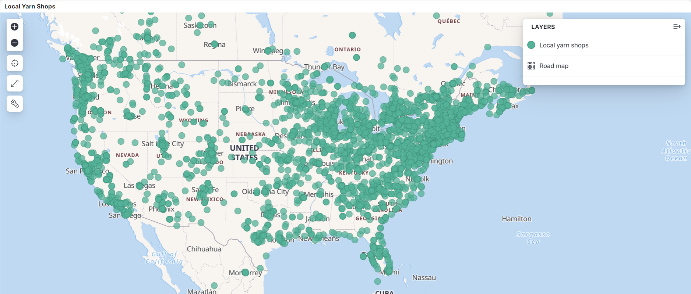
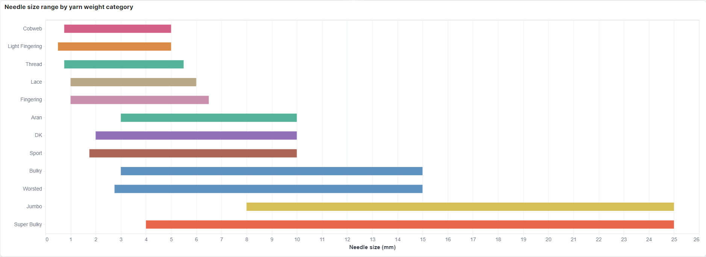
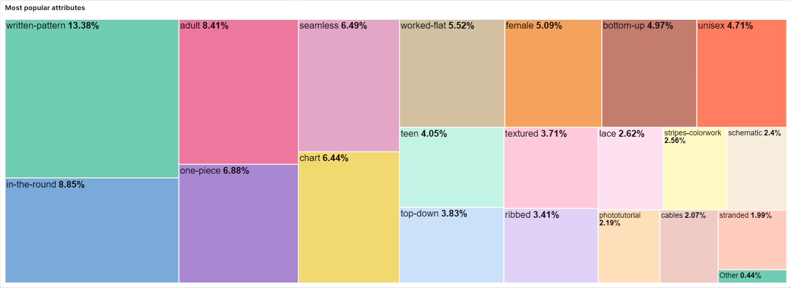
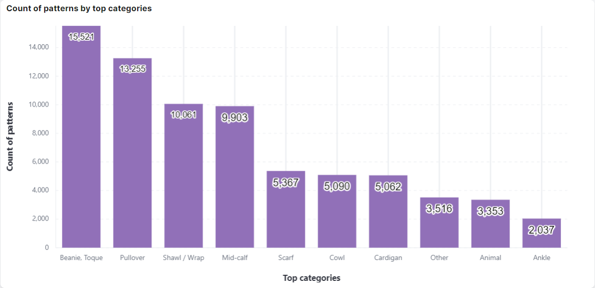
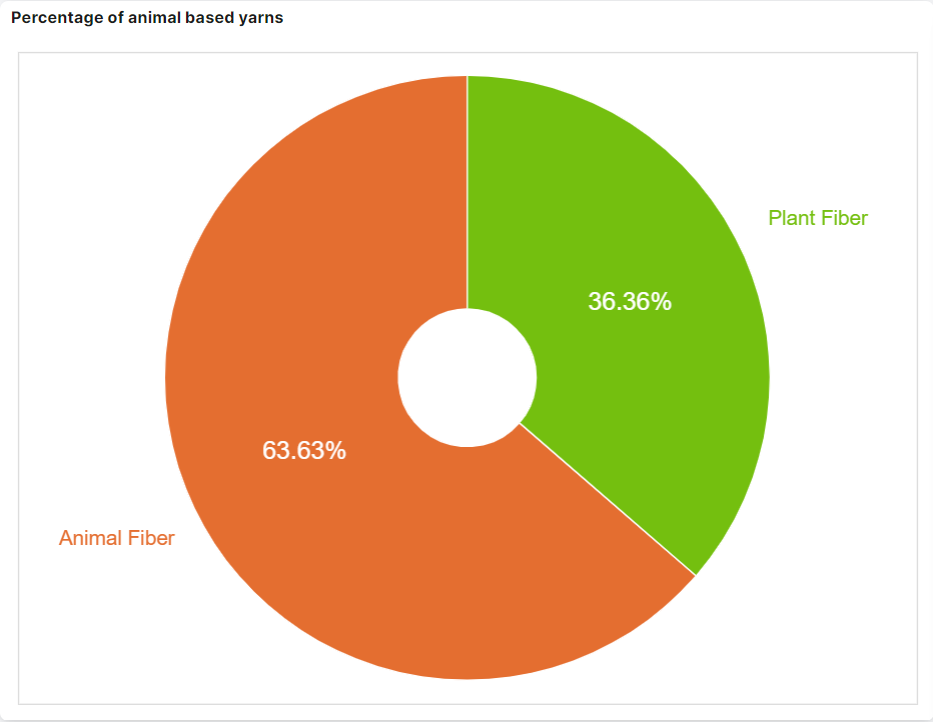
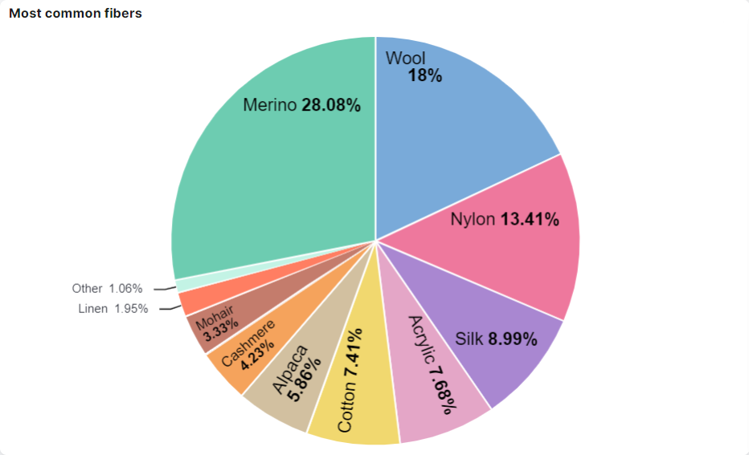
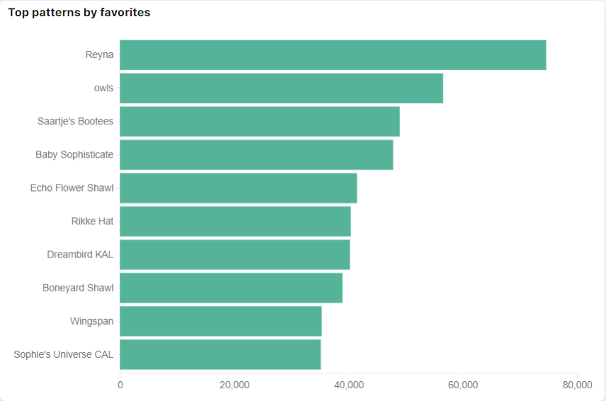
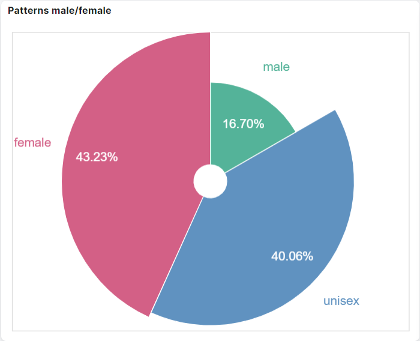

# Ravelry data analysis
Analysis of data available at https://www.ravelry.com. 
The project includes data scrapping via API, putting it asynchronously via
Akka Streams to Elasticsearch and creating Kibana visualizations.

## Authors

* **Agnieszka Ganowicz**
* **Paweł Cembaluk**
* **Bartosz Starosta**

## Built with

* [JetBrains IntelliJ IDEA](https://www.jetbrains.com/idea/)
* [Akka Streams](https://doc.akka.io/docs/akka/current/stream/index.html)
* [Elasticsearch](https://www.elastic.co/elasticsearch/)
* [Kibana](https://www.elastic.co/kibana/)
* [Docker](https://www.docker.com/)

## Screenshots

|  |
|:----------------------------------------------:|
|  |
|  |
|  |

|  |  |
|:----------------------------------------------:|:-----------------------------------------------|
|  |  |
